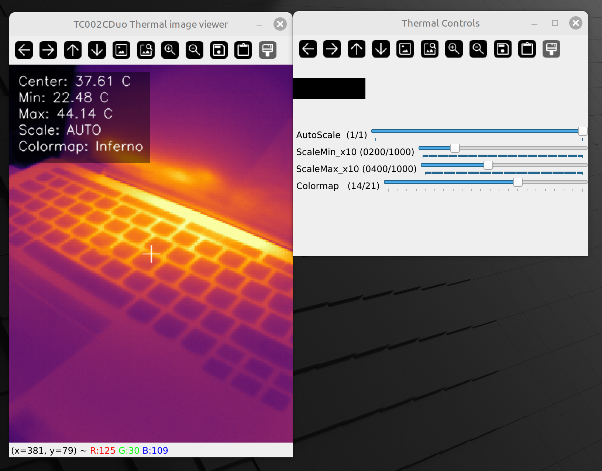

# TC002C-DUO-Viewer
A Python script that decodes the thermal data from a Topdon TC002C DUO thermal camera and displays it. Different from Topdon's Topview software, it allows manual color grade scaling and works on Windows and Linux.
It might work for the other TC002 models from Topdon as well but I haven't tested it. 

I derived the scaling factors from practical measurements so they won't be 100% correct.

A big thank you goes to leswright1977 and his [PyThermalCamera](https://github.com/leswright1977/PyThermalCamera) which was a good starting point.
Different from the TC001 model, the TC002 sends it's own device temperature in metadata row 192 in the video stream. This data must be extracted and used to compansate the temperature shift in the image.
Another difference to his approach is the use of PyAV as openCV automatically converts YUV into BGR under windows, even when you specifically disable it. This would scramble the absolute thermal data.

If you have feature requests, let me know.

Cheers!

